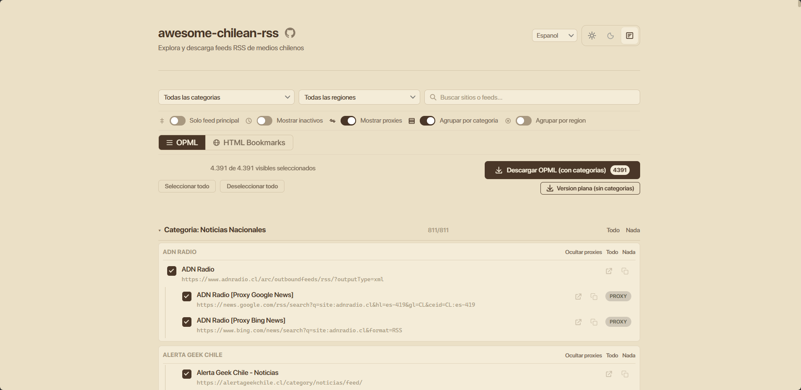

# awesome-chilean-rss-app

Explora y descarga feeds RSS de medios chilenos. Una aplicación web que te permite buscar, filtrar y descargar feeds RSS de diversos medios de comunicación chilenos en formato OPML o HTML.



## Datos

La aplicación consume datos del proyecto [awesome-chilean-rss](https://github.com/alplox/awesome-chilean-rss), que mantiene un directorio actualizado de feeds RSS de medios chilenos.

## Características

- **Directorio completo**: Acceso a feeds RSS de medios chilenos organizados por categorías y regiones
- **Filtros avanzados**: Filtra por categoría, región y busca por nombre de sitio o feed
- **Selección flexible**: Selecciona feeds individuales o por categoría completa
- **Múltiples formatos de descarga**: Exporta en OPML (para lectores de RSS) o HTML
- **Modo agrupado**: Descarga feeds organizados por categorías o en versión plana
- **Temas personalizados**: Elige entre tema claro, oscuro o sepia
- **Soporte multiidioma**: Disponible en español, inglés y portugués
- **Responsive**: Diseño adaptable a dispositivos móviles y escritorio

## Tecnologías

- HTML5
- CSS3 (Vanilla, sin frameworks)
- JavaScript ES6+ (Vanilla, sin frameworks)
- Fetch API para consumo de datos

## Instalación

Este proyecto no requiere instalación de dependencias. Simplemente clona el repositorio:

```bash
git clone https://github.com/alplox/awesome-chilean-rss-app.git
cd awesome-chilean-rss-app
```

## Uso

### Desarrollo local

Para ejecutar la aplicación localmente, necesitas un servidor HTTP. Puedes usar:

**Con Python 3:**
```bash
python -m http.server 8000
```

**Con Node.js (http-server):**
```bash
npx http-server
```

**Con PHP:**
```bash
php -S localhost:8000
```

Luego abre tu navegador en `http://localhost:8000`

### Despliegue

La aplicación es estática y puede ser desplegada en cualquier servicio de hosting estático como:
- GitHub Pages
- Netlify
- Vercel
- Cloudflare Pages

## Estructura del proyecto

```
awesome-chilean-rss-app/
├── index.html          # Página principal
├── style.css           # Estilos
├── js/
│   ├── main.js         # Punto de entrada y coordinación
│   ├── data.js         # Carga de datos desde API
│   ├── download.js     # Funcionalidad de descarga
│   ├── filters.js      # Lógica de filtrado
│   ├── i18n.js         # Sistema de internacionalización
│   ├── render.js       # Renderizado de UI
│   ├── state.js        # Estado global de la aplicación
│   └── theme.js        # Gestión de temas
└── i18n/
    ├── es.js           # Traducciones en español
    ├── en.js           # Traducciones en inglés
    └── pt.js           # Traducciones en portugués
```

## Créditos

- **Datos**: [awesome-chilean-rss](https://github.com/alplox/awesome-chilean-rss) - Directorio de feeds RSS chilenos

## Licencia

MIT. Consulta el archivo LICENSE para más detalles.

## Contribuciones

Las contribuciones son bienvenidas. Si encuentras algún error o tienes sugerencias, por favor abre un issue o pull request en el repositorio.
